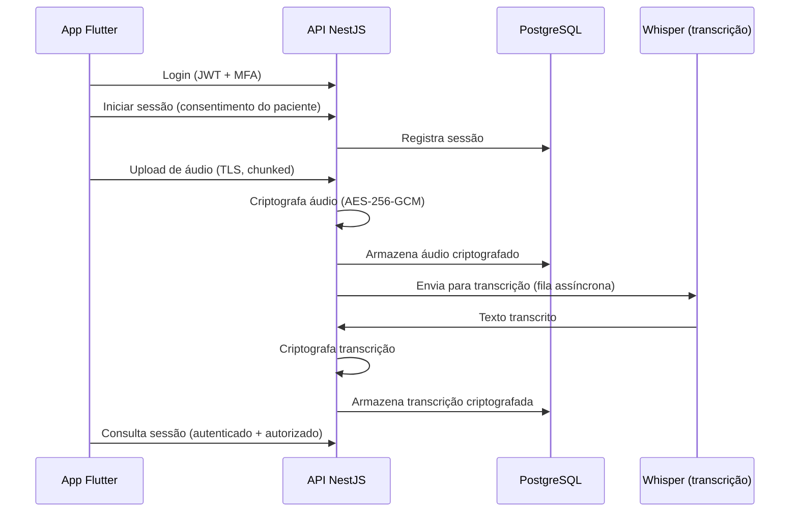

# Arquitetura — TerapiaPremium

## Visão geral

Monorepo com três componentes principais:

```
terapiapremium/
├── apps/
│   ├── mobile/   # App Flutter (Android/iOS) — gravação e consulta
│   └── api/      # API NestJS — autenticação, sessões, transcrições
├── docs/         # Documentação de arquitetura e conformidade
└── docker-compose.yml  # PostgreSQL + Redis para desenvolvimento
```

## Fluxo principal



## Decisões técnicas

| Decisão | Escolha | Motivo |
|---|---|---|
| Mobile | Flutter | Codebase única Android/iOS, bons plugins de áudio |
| Backend | NestJS (TypeScript) | Estrutura modular, DI, ecossistema maduro |
| Banco | PostgreSQL + Prisma | Tipagem forte, migrations versionadas |
| Criptografia | AES-256-GCM | Dados sensíveis de saúde (ver lgpd-compliance.md) |
| Transcrição | Whisper self-hosted | Áudio de pacientes não sai da infraestrutura |
| Cache/Filas | Redis + BullMQ | Transcrição assíncrona |

## Princípios de segurança

1. **Nada em texto plano**: áudio e transcrições são criptografados antes de persistir.
2. **Menor privilégio**: cada profissional só acessa seus próprios pacientes/sessões.
3. **Auditoria**: todo acesso a dados clínicos gera log de auditoria.
4. **Chaves fora do código**: gerenciadas por variáveis de ambiente / secret manager.
